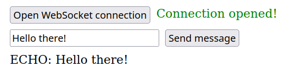

# WebSockets NodeJS server and client

This a basic implementation of a WebSocket server using NodeJS for the backend, as well as 
a simple frontend for testing (made with HTML and vanilla JS). The frontend gives the user the possibility of connecting to the locally-running backend, sending a message, and displaying on screen the echo of said message:

The code is explained in detail in [this blog post](https://writingintothevoidmain.gatsbyjs.io/blog/simple-websocket-server-with-node-js/).

# Running the app

Simply run `npm install & npm run start` inside `/backend` to fire up the server. Then, you can open the `index.html` file inside `/frontend` in your browser of choice to use the app. Alternatively, you can use the server to debug any frontend application that uses WS connections.

